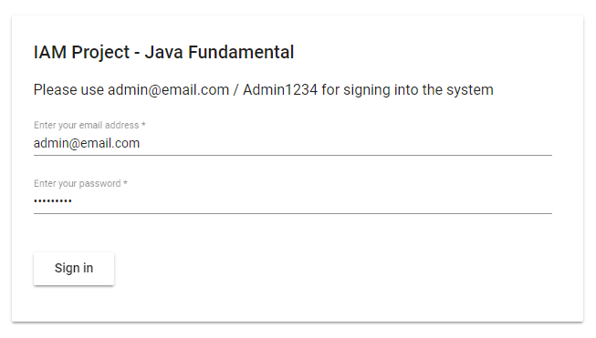
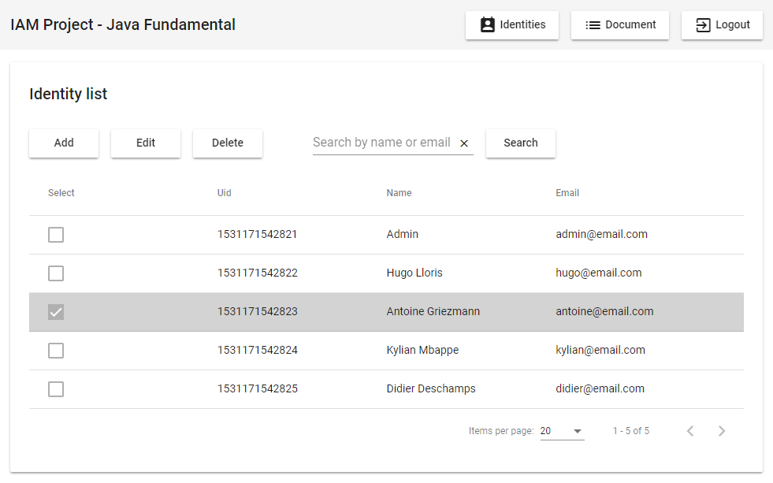
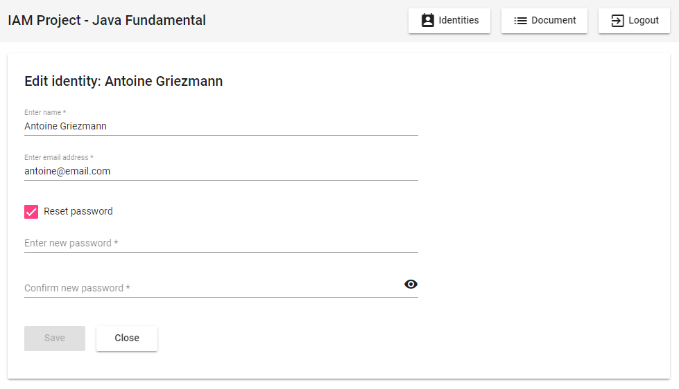
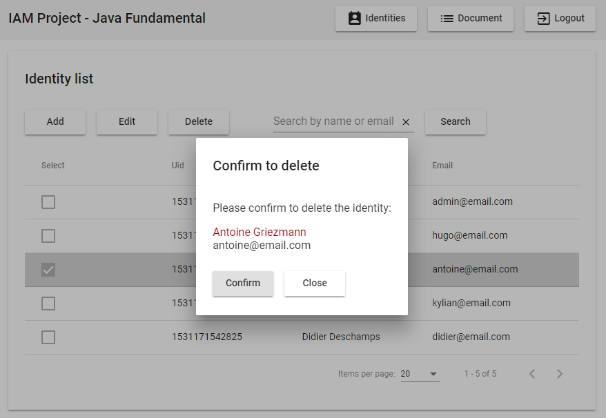

# IAM-project Java Fundamental

This project develop an API service to manage user's identity with some key features:

- User's identity is stored in H2 database
- A DAO class to perform CRUD operations on identity table
- Service layer that performs identity management thru DAO class
- User interface to demonstrate API service

## Tech/framework used

API service is developed in Java 8.0. It is a Maven project, built with Spring Boot version 2.0.3. Database for storage is H2 Database Engine runtime version 1.4.197, embedded mode.

Dependencies are:

- spring-boot-starter-actuator
- spring-boot-starter-web
- spring-boot-starter-jdbc
- spring-boot-devtools
- spring-boot-starter-test
- spring-boot-starter-security
- com.fasterxml.jackson.core
- io.jsonwebtoken
- org.apache.logging.log4j
- com.h2database

User interface is developed with Angular 6.0.7 and Angular Material 6.3.2

## Database storage

The application is using Java JDBC to connect with and H2 Database Engine.

Identities are stores in 'Identities' table of schema 'IAM_Philip'. The physical database file and schema name can be change via modifying file 'resources/application.properties'

Identities table structure:
| Field           | Data type    | Notes       |
|-----------------|--------------|-------------|
| uid             | long         | Primary key |
| name            | varchar(255) |             |
| email           | varchar(255) | Unique      |
| normalizedEmail | varchar(255) |             |
| passwordHash    | varchar(255) |             |

## Features

The most difficult task completed in this project is the DAO implementation with generic data type. This allows us to implement an CRUD operation to any single table, regardless number of fields and data type.

The current project has limitation and can not work with table that has master-detail relationship or foreign key. 

## Installation

Steps to try the project:

- Download file "/target/iam-philip-0.0.1.jar" to your computer
- Run the application by typing "java -jar your_folder\iam-philip-0.0.1.jar" in your command prompt
- Visit url [localhost:8080](localhost:8080) and login into the interface with username/password is admin@email.com/Admin1234

The application create first 5 identities as the sample for your test.
**Every time you restart the application, the database is reset back to this 5-identities list.**

## Screenshots

Below screenshots instruction you how to use the user interface.

- User sign in screen:

- Identity list - Default page:

- Click 'Add' button to add a new identity. Click at an identity to highlight it and click 'Edit' button:

- Click 'Delete' button and confirm to delete an identity:

## API Reference

Route "/api/identities" is the interface of IAM-Project with external application. 
To make calls to this API, you need to send the API token in a Authorization HTTP header using the Bearer authentication scheme. API token can be acquired via sign in thru URL /login.

##### Get an identity - GET request

Get information of an identity base on its primary key. URL sample: `/api/identities/1531171542822`

Parameters:

- uid - An unique id of the identity. Integer 64 bits

Returns: Search result.

- Http response sample: `{model: { email : "hugo@email.com" name : "Hugo Lloris" uid : 1531171542822}, message: "", hasError: false, errorMessage: ""}`

- Http response sample when no identity found: `{model: null, message: "", hasError: false, errorMessage: ""}`

##### Search identities - GET request

Search for identities name or email that contain keyword specified in "filter" parameter. URL sample: `/api/identities?filter=xyz`

Parameters:

- filter - the keyword for searching. Sample API that search for identities containing the keyword "go": `/api/identities?filter=go`

Returns: Search result.

- Http response sample: `{model: [{uid: 1531171542822, name: "Hugo Lloris", email: "hugo@email.com"}], message: "", hasError: false, errorMessage: ""}`
- Http response sample when no identity found: `{model: null, message: "", hasError: false, errorMessage: ""}`

##### Create new identity - POST request

Create a new identity according to the parameter received in post http request body. URL sample: `/api/identities`

Parameters:

- request - The identity in JSON format. Sample request body: `{"uid": 0, "name":"Admin", "email":"admin@email.com", "password":"Admin1234"}`

Returns: Create result.

- Http response sample: `{model: {uid: 1531171542822, name: "Hugo Lloris", email: "hugo@email.com"}, message: "", hasError: false, errorMessage: ""}`
- Http response sample when creating identity has error: `{model: {uid: 1531171542822, name: "Hugo Lloris", email: "hugo@email.com"}, message: "", hasError: true, errorMessage: "This email is already used. Choose a new one"}` 

Detail error can be found in server's log.

##### Update an identity - PUT request

Update identity according to the data received in http request body. URL sample: `/api/identities/1531171542822`

Parameters:

- request - Same as POST request value

Returns: Update result. 

- Http response is same as POST request

##### Partially update an identity - PATCH request

Update identity according to the data received in http request body, EXCEPT the password property. URL sample: `/api/identities/1531171542822`

Parameters:

- request - Same as POST request value

Returns:

- Patch result. Http response is same as POST request

##### Delete an identity - DELETE request

Delete the identity base on its primary key. URL sample: `/api/identities/1531171542822`

Parameters:

- uid - An unique id of the identity. Integer 64 bits

Returns: Delete result.

- Http response sample when delete record successfully: `{model: null, message: "", hasError: false, errorMessage: ""}` 

- Http response sample when there is error: `{model: null, message: "", hasError: false, errorMessage: "Error when deleting identity. Please try again"}`

##### Detail technical document can be found at the /doc folder of the project

## Tests

Please run the file "src\test\java\fr\epita\sp18\ApplicationTests.java" to test the Identity service and DAO features. The developed test scheme is:

- Create an identity
- Get the newly created identity from database and compare it with the initial data
- Search the newly created identity by its email. Compare the result with the initial data 
- Use BCryptPasswordEncoder check if the raw and hashed password are matched 
- Change name and email of that identity 
- Read it again to test the update result
- Delete the identity by it UID
- Get it again (should be null) to test the deleting result

## References & Credits

IAP-Project requirement and guidelines: [http://www.thomas-broussard.fr/work/java/courses/project/index.xhtml](http://www.thomas-broussard.fr/work/java/courses/project/index.xhtml)

Spring Boot and Spring JDBC With H2 [https://dzone.com/articles/spring-boot-and-spring-jdbc-with-h2](https://dzone.com/articles/spring-boot-and-spring-jdbc-with-h2)

Stackoverflow: Service and DAO [https://stackoverflow.com/questions/45490749/service-and-dao-vs-mvc](https://stackoverflow.com/questions/45490749/service-and-dao-vs-mvc)

Domain-Driven Design and MVC Architectures  [https://blog.fedecarg.com/2009/03/11/domain-driven-design-and-mvc-architectures/](https://blog.fedecarg.com/2009/03/11/domain-driven-design-and-mvc-architectures/)

Creating a REST Web Service With Java and Spring [https://dzone.com/articles/creating-a-rest-web-service-with-java-and-spring-p-1](https://dzone.com/articles/creating-a-rest-web-service-with-java-and-spring-p-1)

Exception Handling in Java [https://www.journaldev.com/1696/exception-handling-in-java](https://www.journaldev.com/1696/exception-handling-in-java)

Securing Spring Boot with JWTs [https://auth0.com/blog/securing-spring-boot-with-jwts/](https://auth0.com/blog/securing-spring-boot-with-jwts/)

Angular 5 JWT Authentication (Spring Boot Security) [https://www.devglan.com/spring-security/angular-jwt-authentication](https://www.devglan.com/spring-security/angular-jwt-authentication)

How to Integrate Angular 6 & SpringBoot 2.0 RestAPI [http://javasampleapproach.com/frontend/angular/how-to-integrate-angular-6-springboot-2-0-restapi-springtoolsuite#Integrate_SpringBoot_RestAPI_038_Angular_6](http://javasampleapproach.com/frontend/angular/how-to-integrate-angular-6-springboot-2-0-restapi-springtoolsuite#Integrate_SpringBoot_RestAPI_038_Angular_6)

Error Handling & Angular [https://medium.com/@aleixsuau/error-handling-angular-859d529fa53a](https://medium.com/@aleixsuau/error-handling-angular-859d529fa53a)
